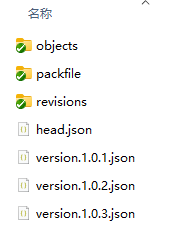

# LayaDCC 2.0
LayaDCC2.0是为LayaNative提供的热更方案，是LayaDCC的升级版，主要特点：
1. 更新文件的时候不再使用原始目录，文件名字变成了文件内容的hash，确保不会被CDN缓存。
2. 支持app打包资源。
3. 支持通过zip提供差异更新。
4. 支持清理缓存。
5. 保证版本一致性，客户端只会使用一个版本，不会出现不同版本资源混用的情况。
6. 通过扩展可以支持网页、小游戏等其他平台。

## 界面
目前LayaDCC在构建项目阶工作。在构建windows,ios,android项目的时候，会有dcc相关选项，如图1-1


### 参数介绍：

1. 打包资源:

是否把为当前平台导出的资源（resource目录）打包到native项目中。
打包的资源会放到特定的目录中，以供后续生成不同平台的app。 

如果希望提供单机版，则必须选择打包资源。

打包资源的本质是生成一个完整的dcc目录，放到项目的特定目录下。不同发布平台对应的路径如下：

**windows**: release\windows\project\resource\cache\dcc2.0\

**android**:    release\android\android_project\app\src\main\assets\cache\dcc2.0\

**ios**: release\ios\ios_project\resource\cache\dcc2.0\

2. 混淆资源： 

如果选中的话，在打包资源的时候，会随机混淆资源，主要作用是避免在上架的时候被平台扫描到某些敏感函数。


3. 资源服务器URL
这个设置会决定native启动的时候访问的入口脚本。

4. 热更新(DCC)

4.1 根文件

设置dcc系统的根文件地址, 根文件维护一个完整的目录树，决定了一个版本的具体内容。

4.2 DCC服务器

设置dcc服务器的地址。如果为空，则使用根文件所在的地址为dcc服务器地址。

4.2 生成热更新资源

这个选中的话会在构建的时候同时生成dcc资源，生成的dcc资源可以放到dcc服务器上，提供热更新内容。
这个目录在release/平台/dcc目录下，结构如下:



4.2.1 版本

生成dcc资源的版本号，这个会影响生成的dcc根文件，例如设置为1.0.0，则dcc的输出目录会生成一个 version.1.0.0.json的根文件。参见上图的例子。

注意，在生成dcc的时候，会更新两个根文件，一个是指定版本号的，例如version.1.0.1.json,一个是指向最新版本的head.json。所以如果选择head.json，就是指向最新的dcc。

4.2.2 版本描述

当前版本的描述。这个信息回保存到dcc的根文件中。

4.3 保留历史版本

生成dcc资源的时候是否删除老的dcc资源，建议选中，这样以后可以通过切换dcc根文件来切换不同的版本。
如果不选择这个，之前的版本会被删除，且不可恢复。


## 概念介绍

1. DCC服务器

DCC服务器是一个静态文件服务器，保存了所有的dcc对象。dcc客户端在需要获得某个对象的时候，就是到这里下载相应的文件。
在使用DCC的情况下，游戏资源都是通过DCC服务器获得的，原始的游戏资源服务器很少被访问（只有不在DCC目录树下的资源才会到原始资源服务器下载）。

2. DCC根文件

又称为DCC头文件，指定了某一版的资源树，从这里可以遍历所有的这一版的资源。

3. 映射地址

当Laya/Native发起一个下载请求的时候，会被DCC拦截，dcc根据设置的映射地址过滤这个地址，如果符合映射地址，则会走dcc流程，例如， 设置的映射地址是 dcc.pathMapToDCC='http://layabox.com/game', 当请求 'http://layabox.com/game/res/skin1.png'的时候，就会走dcc流程，在dcc内部会先转成相对地址 'res/skin1.png', 然后查找到这个相对地址对应的对象id，然后下载指定id的对象。

如果请求下载的地址不符合映射地址，则会直接下载原始地址的内容。


## 命令行工具（测试版）
除了可以在构建项目的时候生成dcc，还可以通过命令行来更灵活的实现相同功能。
```bash
npm install -g layadcc2
```
安装完以后，可以直接使用 layadcc2 命令。
用法如下：

```bash
Usage:  [options] [command] <dir>

layadcc2命令工具

Arguments:
  dir                                         输入目录

Options:
  -V, --version                               output the version number
  -o, --output <outDir>                       指定输出目录,如果是相对目录，则是相对于当前目录目录 (default: "dccout")
  -m, --merge                                 是否合并小文件
  -y, --overwrite                             是否覆盖输出目录（保留历史记录需要覆盖）
  -h, --help                                  display help for command

Commands:
  genpatch [options] <inputDir1> <inputDir2>  生成补丁文件
  checkout [options] <inputDir>               把dcc目录恢复成原始结构
```
基本用法：
1. 生成dcc资源
```bash
layadcc2 ./resource -o ./dccout
```
这个会给resource目录生成dcc，输出到dccout下面。
目前没有做详细的参数，如果要保存多个版本，可以自己去dccout下面修改json文件的名字，然后把整个目录合并到之前的dccout目录下。

2. 生成差异包
```bash
layadcc2 genpatch ./dcc1 ./dcc2
```
TODO：
1. 支持版本号差异
2. 指定输出文件

这个
3. 把dcc资源恢复成原始资源
```bash
layadcc2 checkout ./dcc1
```
这个把dcc1目录下的head.json指向的版本展开成原始目录，放到checkout目录下

TODO：
1. 指定版本
2. 指定输出目录


## 常见用法

1. 构建单机版APP
构建的时候选择"打包资源"，并且保留 "资源服务器URL" 为空。

2. 普通更新流程
构建的时候可以打包资源，也可以不打包。
设置"热更新(DCC)"/"根文件" 为指定的url，例如 "https://laya.com/layagame1/dcc/head.json"

选中"生成热更资源"，以生成DCC数据。构建完成后，把dcc目录放到dcc服务器上，例如 "https://laya.com/layagame1/dcc/", 这个要与上面的根文件一致。

这样发布的app就能根据指定根文件进行资源热更。之前发布的app，如果指定的是同一个根文件，也会在启动后触发热更。

注意：如果使用固定名称的根文件，可能会由于CDN缓存导致无法获取最新的文件内容。所以这时候可以给根文件一个非cdn地址，或者一个动态页面地址。但是这时候通常就不能把dcc服务器的地址设置为空了。

zip更新流程
目录更新流程
native导出对象
普通更新流程


## 内部解释
打包资源与dcc的关系
相同


## 通过代码的使用方法

LayaDCCClient的接口定义：

```typescript
export class LayaDCCClient{
    
    onlyTransUrl:boolean;
    //映射到dcc目录的地址头，如果没有，则按照http://*/算，所有的请求都裁掉主机地址
    pathMapToDCC:string;
    
    /**
     * 
     * @param frw 文件访问接口，不同的平台需要不同的实现。如果为null，则自动选择网页或者native两个平台
     * @param dccurl dcc的服务器地址
     */
    constructor(dccurl:string, frw:new ()=>IGitFSFileIO|null, logger:ICheckLog=null)

    enableLog(b:boolean)
    
    /**
     * 初始化，下载必须信息 
     * @param headfile dcc根文件，这个文件作为入口，用来同步本地缓存。如果为null则仅仅使用本地缓存
     * @param cachePath 这个暂时设置为null即可 
     * @returns 
     */
    async init(headfile:string|null,cachePath:string):Promise<boolean>;
    
    /**
     *  读取缓存中的一个文件，url是相对地址
     * @param url 用户认识的地址。如果是绝对地址，并且设置是映射地址，则计算一个相对地址。如果是相对地址，则直接使用
     * @returns 
     */
    async readFile(url:string):Promise<ArrayBuffer|null>

    /**
     * 把一个原始地址转换成cache服务器对象地址
     * @param url 原始资源地址
     * @returns 
     */
    async transUrl(url:string)

    /**
     * 与DCC服务器同步本版本的所有文件。
     * 可以用这个函数来实现集中下载。
     * 
     * @param progress 进度回调，从0到1
     * 注意：在开始同步之前可能会有一定的延迟，这期间会进行目录节点的下载。不过目前的实现这一步在init的时候就完成了
     * 
     */
    async updateAll(progress:(p:number)=>void);
        
    /**
     * 根据指定的zip文件更新本地缓存。
     * 这个zip文件可以通过DCC插件的补丁生成工具来生成。
     * 
     * 这个会修改本地保存的root
     * @param zipfile 打补丁的zip文件，注意这里必须是本地目录，所以需要自己实现下载zip到本地之后才能调用这个函数。
     * @param progress 进度提示，暂时没有实现。
     */
    async updateByZip(zipfile:string,zipClass:new()=>IZip, progress:(p:number)=>void);

    /**
     * 清理缓存。
     * 根据根文件遍历所有本版本依赖的文件，删除不属于本版本的缓存文件
     */
     async clean()
     
    //插入到laya引擎的下载流程，实现下载的接管
    injectToLaya();
    //取消对laya下载引擎的插入
    removeFromLaya();
}
```

生成DCC
```typescript
    let srcPath = '资源的绝对路径'
    let dcc = new LayaDCC();
    //配置参数
    let param = new Params();
    param.version = '1.0.0';
    param.dccout = '输出的绝对路径'
    dcc.params = param;
    //开始生成dcc数据
    await dcc.genDCC(srcPath);
```

生成版本之间的差异zip
带root

打包某个目录到一个zip
不带root

打包某个目录到一个pack文件
带index

根据文件列表生成pack包
```typescript
import {layadcctools} from './dist/layadcctools.js'
const {LayaDCCTools,LayaDCC,Params,PackRaw} = layadcctools;

layadcctools.LayaDCCTools.genPackByFileList( [
    'D:/work/ideproj/DCCPlugin/release/web/internal/sky.jpg',
    ],
    'd:/temp/ddd1.pack', layadcctools.PackRaw)

```

根据版本号生成差异包

2. 使用dcc
对于使用dcc，基本流程是根据根文件初始化，然后插入laya引擎的downloader，之后下载就会被dcc接管
```typescript
//创建DCC客户端，参数是DCC服务器地址
let dcc = new DCCClient('http://localhost:7788/' );
//设置这个地址下的资源加载走DCC模式
dcc.pathMapToDCC= 'http://localhost:8899/';
//通过DCC的根文件初始化dcc客户端
let initok = await dcc.init('http://localhost:7788/version.3.0.0.json',null);
//把dcc功能插入laya引擎
dcc.injectToLaya();
```

3. native端使用dcc
```javascript
var appUrl = "http://stand.alone.version/index.js";
var dccHead = "http://10.10.20.26:6666/head.json";
var dccUrl = null;
var mapToDCC = null;
let layadcc = require('layadcc.js').layadcc;
let dcc = new layadcc.LayaDCCClient(dccUrl || getBaseUrl(dccHead));
dcc.pathMapToDCC = mapToDCC || getBaseUrl(appUrl);
dcc.init(dccHead, null).then((ok) => {
    if (ok) {
        //如果初始化成功，接管native的下载流程
        dcc.injectToNative3();
    }
    window.layadcc = layadcc;
    window.dcc = dcc;
    loadApp(conch.presetUrl || appUrl);
});
```
现在native中已经包含这段代码（index.js中），可以通过layadcc访问dcc库导出的对象，通过dcc访问native创建的LayaDCCClient


3. 集中更新所有资源，避免边运行边下载
```typescript
let dcc = new DCCClient('http://localhost:7788/' );
dcc.pathMapToDCC= 'http://localhost:8899/';
let initok = await dcc.init('http://localhost:7788/version.3.0.0.json',null);
await dcc.updateAll((p)=>{/*进度提示*/})
```

4. 使用zip更新
```typescript
    async function downloadBigZip(url:string):Promise<string|null>{
        let cachePath = conch.getCachePath();
        let localfile =  cachePath+url.substring(url.lastIndexOf('/'));
    
        return new Promise((resolve,reject)=>{
                downloadBigFile(url, localfile, (total, now, speed) => {
                    console.log(`downloading:${Math.floor((now / total) * 100)}`)
                    return false;0
                }, (curlret, httpret) => {
                    if (curlret != 0 || httpret < 200 || httpret >= 300) {
                        resolve(null);
                    }
                    else {
                        resolve(localfile);
                    }
                }, 10, 100000000);        
            }
        );
    }

    let zipfile = await downloadBigZip('http://10.10.20.26:8899/update/dccout1.zip')
    let client = new DCCClient('http://101.10.20.26:6677/dccout2');
    let iniok = await client.init(dccurl+'/head.json', null);
    
    await client.updateByZip(zipfile, Zip_Native,null);
```
注意，zip是通过dcc插件生成的zip文件，有特定的文件组织形式。

5. 清理本地缓存
```typescript
let dcc = new DCCClient(null);
await dcc.clean();
```

## 其他功能
enableLog:boolean  是否打印日志，设置为true之后，会有更多打印信息，有助于调试。
onlyTransUrl:boolean 只做地址转换功能，即把一个url请求转换成对缓存对象的请求，不会在本地存储这个对象。例如在网页端，只是希望保证文件资源是正确的，可以设置为这个true。
高级用法
1. 适配其他平台
用户可以自己实现一个 IGitFSFileIO 接口，并传给DCCClient的构造函数，就可以支持新的平台，主要是提供本地文件的读写功能。

## 常见问题
1. dcc是否能读取apk中打包的资源，需要特殊设置么？
能读取，不需要特殊设置，直接可用。
2. 网页端可以使用layadcc2么
可以把layadcc项目包含到自己的项目中，或者加载layadcc.js，然后在网页中使用。
网页使用会通过indexdb来缓存资源。缺点是只能接管laya的downloader，所以无法接管系统的xhr，且必须在laya初始化完成之后才能起作用。
2. 是否支持微信小游戏
这个可以通过自己扩展来实现，参见 高级用法
3. 是否可以在以前版本的native中使用dcc2
可以，但是由于老版本的native无法关掉老版本的缓存功能，因此可能会造成多余的空间占用。
4. 在网页端是否可以接管开始的js的下载？
目前还不能，在网页端的dcc目前依赖laya引擎。native端可以不依赖。


## TODO