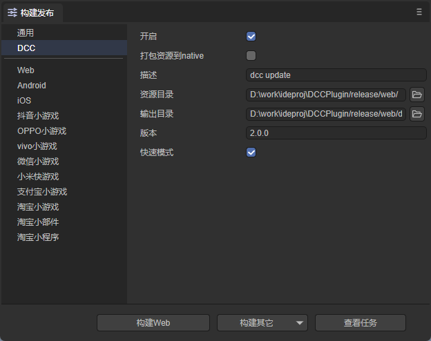

## LayaDCC 2.0
LayaDCC2.0是原来的DCC的更新版。主要特点：
1. 以插件的形式提供，因此可以应用于多个平台
2. 下载文件的时候不再使用原始目录，而是hash之后的地址，保证不被CDN缓存
3. 支持APK中包含资源
4. 支持清理缓存




## 基本用法
生成dcc
```typescript
    let srcPath = '资源的绝对路径'
    let dcc = new LayaDCC();
    let param = new Params();
    //配置参数
    param.version = '1.0.0';
    dcc.params = param;
    param.dccout = '输出的绝对路径'
    await dcc.genDCC(srcPath);
```
使用dcc
```typescript

    let dcc = new UniDCCClient( 'http://localhost:7788/' );
    dcc.pathMapToDCC= 'http://localhost:8899/';

    let initok = await dcc.init('http://localhost:7788/version.3.0.0.json',null);
    if(!initok)
        return false;
    
    //把具有dcc功能的下载器插入laya引擎
    let downloader = new DCCDownloader(dcc);
    downloader.injectToLaya();

```

## 详细说明

1. 生成DCC
2. 使用DCC
设置head


## 高级用法
适配平台

## 打包资源
资源路径

## 全部更新
```typescript
 async updateAll(progress:(p:number)=>void)
```
progress是回调函数，p是进度，到1表示结束

## zip方式更新
zip必须是特定格式，不能直接把某个目录打包。

### 生成zip
```typescript
class LayaDCCTools{
    static async genZipByComparePath(dccold:string, dccnew:string,outPath:string,outFile?:string);
}
```
输入两个目录，分别对应不同版本的dcc资源，计算出这两个目录的差异，把差异文件打包成一个zip。
### 使用zip
```typescript
async updateByZip(zipfile:string,zipClass:new()=>IZip, progress:(p:number)=>void);
```
其中的zipClass在native环境下可以使用 Zip_Native 类。
使用示例如下：
```typescript
    async function downloadBigZip(url:string):Promise<string|null>{
        let cachePath = conch.getCachePath();
        let localfile =  cachePath+url.substring(url.lastIndexOf('/'));
    
        return new Promise((resolve,reject)=>{
                downloadBigFile(url, localfile, (total, now, speed) => {
                    console.log(`downloading:${Math.floor((now / total) * 100)}`)
                    return false;
                }, (curlret, httpret) => {
                    if (curlret != 0 || httpret < 200 || httpret >= 300) {
                        resolve(null);
                    }
                    else {
                        resolve(localfile);
                    }
                }, 10, 100000000);        
            }
        );
    }

    let zipfile = await downloadBigZip('http://10.10.20.26:8899/update/dccout1.zip')
    let client = new UniDCCClient('http://101.10.20.26:6677/dccout2');
    let iniok = await client.init(dccurl+'/head.json', null);
    await client.updateByZip(zipfile, Zip_Native,null);


```

## 清理缓存
在更新一段时间后，dcc会缓存一些已经过时的资源，白白占用设备空间，可以通过LayaDCCClient的clean函数清理。这个函数会遍历当前最新版的文件，删掉多余的文件。

开关日志

## 常见问题
怎么在最开始的时候起作用，那时候还没有downloader